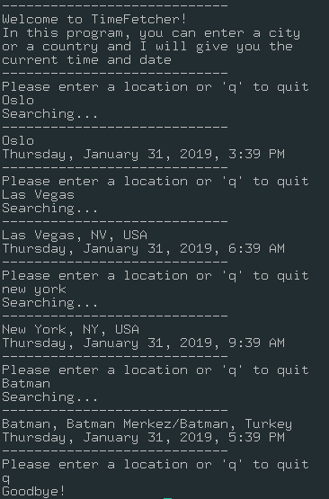

# TimeFetcher
This is a java CLI-application for finding the time in a city or a country anywhere in the world. I created it as a tool to be used in an assignment for a course in *Networking and Cloud Computing* at Oslomet.

### In use

